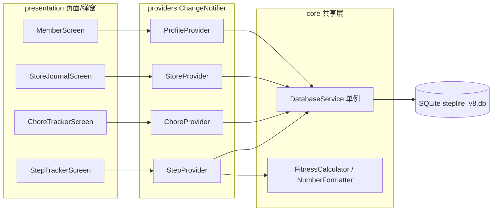

# StepLife（步履生活）架构说明

> 本文档基于当前仓库代码整理（v1.3.0+20260730，SQLite Schema v8），用于快速了解项目结构、数据流与扩展方式。

## 1. 项目概览

- **定位**：个人生活记录与打卡类跨平台应用，覆盖「路线步数打卡、家务习惯追踪、生活记录（探店/影视/阅读/景点）、家庭成员管理」四大业务域。
- **平台**：Flutter 跨平台，支持 Android / Windows / iOS / Linux / macOS。
- **数据**：全部本地化，SQLite 持久化，无后端服务、无网络依赖。
- **入口**：`lib/main.dart`，底部导航共 5 个 Tab：路线 / 家务 / 生活 / 成员 / 关于。

## 2. 技术栈

| 类别 | 选型 | 说明 |
| --- | --- | --- |
| UI 框架 | Flutter (Material 3) | 深色毛玻璃（Glassmorphism）风格 |
| 状态管理 | `provider` 6.x | `ChangeNotifier` + `MultiProvider` |
| 本地数据库 | `sqflite` + `sqflite_common_ffi` | Schema v9，数据库文件 `steplife_v9.db`（升级前自动备份旧 v8 库） |
| 图表 | `fl_chart` / `flutter_heatmap_calendar` | 成员贡献饼图、年度热力图 |
| 字体 | `google_fonts`（Outfit） | 全局字体 |
| 图片 | `image_picker` | 生活记录最多 3 张照片 |
| 其他 | `intl` / `path` | 日期格式化、路径拼接 |

## 3. 目录结构

```
lib/
├── main.dart                          # 应用入口：FFI 初始化、MultiProvider、主框架(PageView+底部导航)
├── core/                              # 跨功能共享层
│   ├── db/
│   │   └── database_service.dart      # SQLite 单例 DAO：Schema v9、非破坏迁移、app_settings CRUD
│   ├── settings/                        # 设置中心（右上角齿轮全局入口）
│   │   ├── settings_provider.dart       # 设置状态：主题/视图/缓存/WebDAV/TMDB
│   │   ├── settings_screen.dart         # 设置中心 UI
│   │   └── settings_button.dart         # 全局设置按钮
│   ├── cache/                           # 缓存管理
│   │   ├── cache_manager.dart           # 图片复制/统计/按上限清理
│   │   └── image_migrator.dart          # 旧相册路径惰性迁移
│   ├── network/                         # 网络客户端
│   │   └── tmdb_client.dart             # TMDB 搜索/详情/海报（可选接入）
│   ├── sync/                            # WebDAV 同步
│   │   ├── webdav_service.dart          # 轻量 WebDAV（MKCOL/PUT/GET/PROPFIND）
│   │   └── sync_service.dart            # 备份/恢复编排
│   ├── theme/
│   │   └── app_theme.dart             # 全局深色主题与颜色 Token
│   └── utils/
│       ├── fitness_calculator.dart    # 步长/公里/MET 卡路里换算算法
│       └── number_formatter.dart      # uHabits 风格数值缩写（1.2k / 1.5M）
└── features/                          # 按业务功能划分，每个模块内含 domain/presentation/providers
    ├── step_tracker/                  # 路线资产与步数打卡
    │   ├── domain/step_models.dart    # RouteItem / StepLog
    │   ├── providers/step_provider.dart
    │   └── presentation/step_tracker_screen.dart
    ├── chore_tracker/                 # 家务习惯追踪
    │   ├── domain/chore_models.dart   # Member / ChoreItem / ChoreLog
    │   ├── providers/chore_provider.dart
    │   └── presentation/ chore_tracker_screen / chore_detail_screen / member_dialog / member_management_dialog
    ├── store_journal/                 # 生活记录（模板化打卡）（探店/影视/阅读/景点）
    │   ├── domain/store_models.dart   # StoreCategory / StoreItem / StoreLog
    │   ├── providers/store_provider.dart
    │   └── presentation/ store_journal_screen / store_detail_screen
    ├── profile/                       # 全局个人生理档案
    │   ├── domain/user_profile.dart   # UserProfile
    │   ├── providers/profile_provider.dart
    │   └── presentation/ member_screen / profile_dialog
    └── about/                         # 关于与版本 Changelog
        └── presentation/about_screen.dart
```

## 4. 分层架构与数据流

采用轻量分层 + Feature-first 组织：

- **presentation**：页面与弹窗，只负责渲染与交互，不直接访问数据库。
- **providers**：`ChangeNotifier`，持有内存态（列表/加载态），构造时通过 `DatabaseService` 加载数据，所有写操作先落库再更新内存并 `notifyListeners()`。
- **domain**：纯 Dart 模型（`fromMap` / `toMap` / `copyWith`），无 Flutter 依赖。
- **core/db**：`DatabaseService.instance` 单例，集中全部 SQL 与表结构。
- **core/utils**：纯函数算法，可单测。



跨模块共享关系：

- **成员档案共享**：`Member` 模型定义在 `chore_tracker/domain`，但步数打卡（`StepProvider.recordStepLog`）与生活记录（同游成员）都复用同一套家庭成员数据。
- **生理参数回退**：步数换算优先使用所选 `Member` 的身高/体重，缺失时回退到全局 `UserProfile`。

## 5. 功能模块

### 5.1 路线步数（step_tracker）
- 客观路线资产 `RouteItem`（名称/描述/测量人/参考步数/锁定状态）与打卡履约 `StepLog`（步行人/圈数/步数/时长/公里/千卡/时刻）严格解耦。
- 路线支持锁定防误删、一键按参考步数倍增打卡。
- 换算逻辑：`FitnessCalculator.estimateStrideLength` → `stepsToKilometers` → `calculateCalories`（MET）。

### 5.2 家务习惯（chore_tracker）
- `ChoreItem`（是否量化 + 单位）与 `ChoreLog`（参与成员 JSON、备注、量化数值）分离。
- 主页 5 天近况矩阵；量化家务按 `NumberFormatter.formatQuantifiableValue` 显示 `1.2k / 15k / 1.5M`。
- `ChoreDetailScreen`：年度热力图 + 成员贡献占比饼图。

### 5.3 生活记录（store_journal）
- `StoreCategory`（分类）、`StoreItem`（客观属性：名称/分类/评分/照片/地址/备注）、`StoreLog`（打卡履约：消费/同游成员/时刻）三层解耦。
- 1~5 星评分、最多 3 张照片（`imagesJson`）、分钟级打卡时刻。
- Card / 紧凑列表双视图，选择通过 `user_profile.preferredViewMode` 持久化。
- Drawer 分类支持创建、重命名、删除（删除后记录自动归入「通用未分类」）。

### 5.4 成员档案（profile + 成员系统）
- `Member`：姓名/性别/身高/体重/出生日期（动态计算年龄）/自定义步长/头像/颜色。
- `MemberScreen` 统一管理成员；`ProfileDialog` 维护全局生理档案。
- `members` 表由 `chore_tracker` 模块定义，但为全局共享数据。

### 5.5 关于（about）
- 版本号 v1.3.0（Build 20260730）、更新记录（Changelog）、内嵌 `assets/walkthrough.md` 说明弹窗。

## 6. 数据库设计（Schema v8）

数据库文件 `steplife_v8.db`，`version: 8`，共 9 张表，全部由 `DatabaseService` 统一管理：

| 表 | 关键字段 | 说明 |
| --- | --- | --- |
| `user_profile` | `heightCm/weightKg/gender/age/customStrideCm/preferredViewMode` | 单行（id=1）全局档案 + 视图偏好 |
| `routes` | `name/description/measuredBy/refSteps/isLocked/createdAt` | 客观路线资产 |
| `step_logs` | `routeId/routeName/walkerName/timesCount/steps/durationMinutes/distanceKm/caloriesKcal/timestamp` | 步数打卡履约 |
| `members` | `name/gender/heightCm/weightKg/customStrideCm/birthDate/avatarIcon/colorValue` | 统一家庭成员（全局共享） |
| `chore_items` | `title/category/iconName/isQuantifiable/unit` | 家务事项定义 |
| `chore_logs` | `choreId/memberIdsJson/memberNamesJson/memo/value/timestamp` | 家务打卡履约 |
| `store_categories` | `name(UNIQUE)/iconName` | 生活记录分类 |
| `store_items` | `name/category/rating/imagesJson/address/notes/createdAt` | 生活项目客观属性 |
| `store_logs` | `storeId/cost/visitorIdsJson/visitorNamesJson/memo/timestamp` | 生活打卡履约 |

迁移策略（详见 `database_service.dart`）：

- `onCreate`：建全部表 + 预置种子数据（成员A/B/C、默认路线、默认家务、默认分类、示例生活项目与打卡）。
- `onUpgrade`：`oldVersion < 8` 时为 `store_logs` 追加 `visitorIdsJson` / `visitorNamesJson`。
- `onOpen`：幂等执行 `ALTER TABLE members ADD COLUMN birthDate`（兼容旧库，报错忽略）。
- 注意：`birthDate` 列在 `onCreate` 中未定义，靠 `onOpen` 统一补齐；后续新装与升级路径保持一致。

## 7. 核心业务算法

| 算法 | 位置 | 说明 |
| --- | --- | --- |
| 步长估算 | `fitness_calculator.dart` | 女性系数 0.413、男性 0.415 |
| 步数→公里 | 同上 | `steps × strideCm / 100000` |
| 卡路里 | 同上 | 按步频映射 MET（2.8~6.0），`MET × 体重(kg) × 时长(h)` |
| 数值缩写 | `number_formatter.dart` | `<1000` 原样、`<1M` 转 `k`、否则 `M` |
| 年龄计算 | `chore_models.dart` | `Member.age` 根据出生日期动态计算 |

## 8. UI 主题与视觉规范

- 主题定义在 `core/theme/app_theme.dart`，全局唯一深色主题 `AppTheme.darkTheme`。
- 颜色 Token：主色 Emerald `#10B981`、辅色 Indigo `#6366F1`、强调 Cyan `#06B6D4`、背景 Deep Midnight `#0B1329`。
- 统一卡片毛玻璃（半透明白 + 圆角 + 细描边）、透明 AppBar、固定式底部导航。
- 字体：Google Fonts Outfit。

## 9. 平台适配与资源

- `main.dart` 在 Windows / Linux / macOS 上执行 `sqfliteFfiInit()` + `databaseFactory = databaseFactoryFfi`，桌面端 SQLite 依赖此初始化，不可删除。
- `pubspec.yaml` 声明资源：`assets/icon/app_icon.png`、`assets/walkthrough.md`、`assets/screenshots/`。
- 原生壳目录：`android/`、`ios/`、`windows/`、`linux/`、`macos/`、`web/`；应用名「步履生活」。

## 10. 测试

`test/` 下现有用例：

- `fitness_calculator_test.dart`：步长/公里/MET 卡路里算法。
- `number_formatter_test.dart`：数值缩写。
- `widget_test.dart`：应用冒烟测试。

## 11. 扩展指南

新增功能模块的推荐步骤：

1. 在 `lib/features/<feature>/domain/` 建纯 Dart 模型（含 `toMap` / `fromMap`）。
2. 在 `lib/core/db/database_service.dart` 增加表结构与 CRUD（改表结构必须递增数据库版本并在 `_onUpgrade` 补迁移）。
3. 在 `lib/features/<feature>/providers/` 建 `ChangeNotifier`，构造时加载数据。
4. 在 `lib/features/<feature>/presentation/` 建页面，仅通过 Provider 读写状态。
5. 在 `main.dart` 注册 Provider，并将页面挂入 `MainHomeScreen` 的 `PageView` / 底部导航。
6. 关键算法放 `core/utils/` 并补充单测。

> 维护提示：`update_rules.md` 为 AI 协作更新规则文档，其中部分内容（Schema v7、4 个 Tab、v1.1.0）已落后于当前代码，建议后续同步更新。