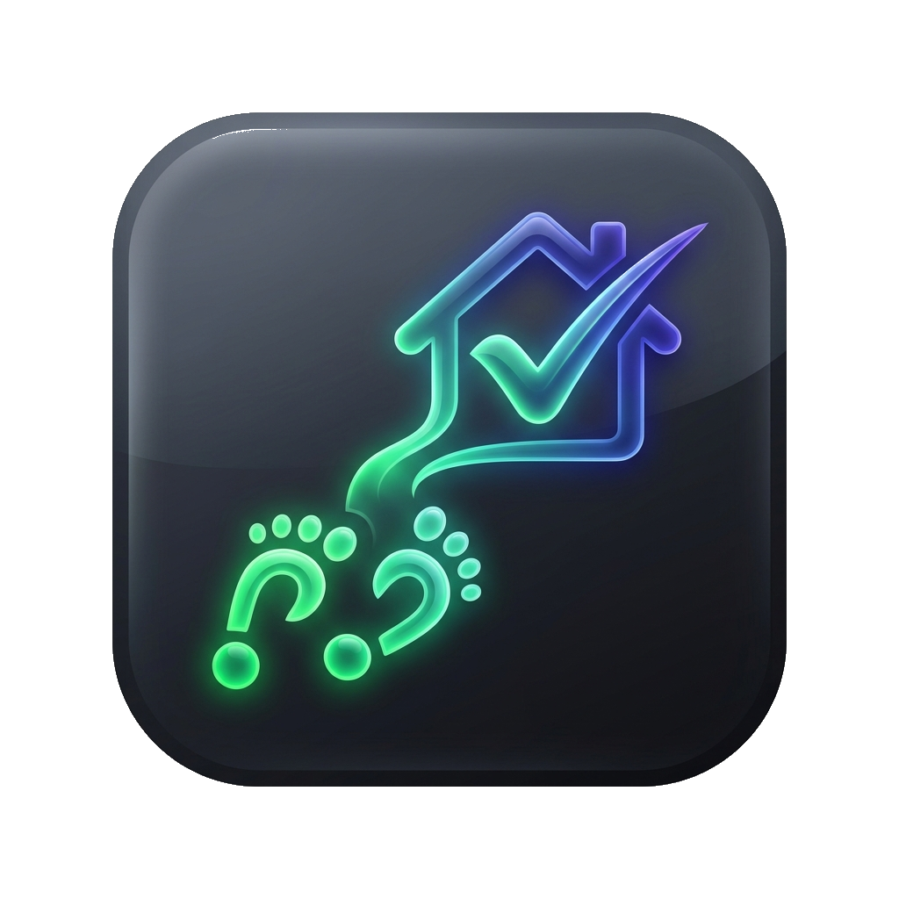
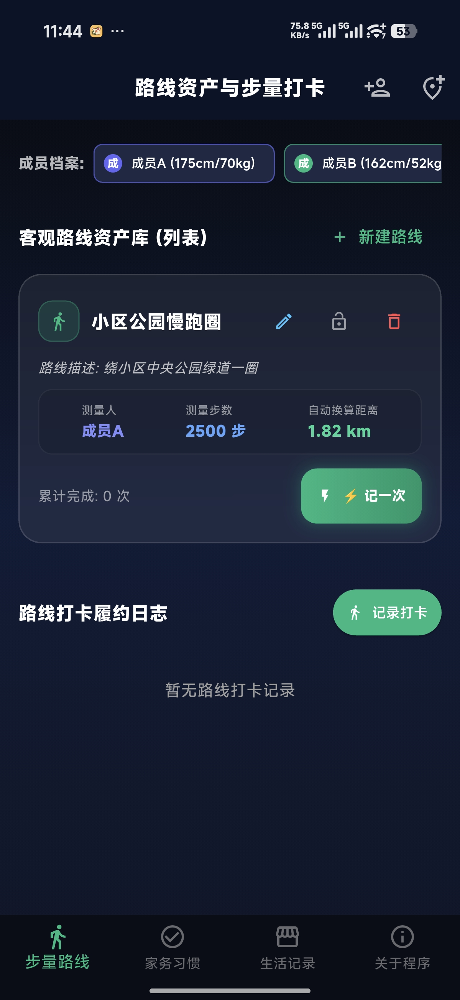
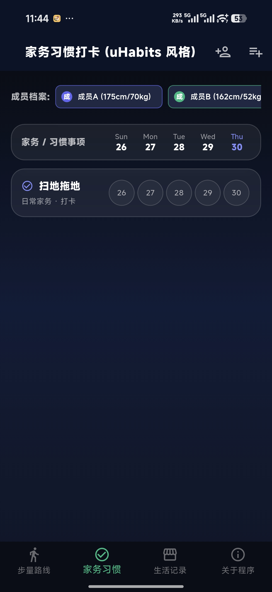

<p align="center">
  
</p>

<h1 align="center">StepLife · 步履生活</h1>

<p align="center">
  <b>涵盖路线步量换算、uHabits 风格家务习惯与生活记录 (探店/影视/图书) 的全能跨平台助手</b>
</p>

<p align="center">
  
  
  
  
  
</p>

---

## 🤖 纯 AI 打造与项目说明
- **作者声明**：非码农专业，本程序根据个人需求高度量身定制。
- 如果你也有类似的个人记录与生活打卡需求，欢迎参考或使用。
- 纯 AI 独立迭代打造，解决问题的能力几乎 = 0（笑）。

---

## 📸 应用界面截图展示 (App Screenshots)


<p align="center">
  
  &nbsp;&nbsp;&nbsp;&nbsp;
  
  &nbsp;&nbsp;&nbsp;&nbsp;
  
</p>

| 🏃 步量路线打卡 | 🏠 uHabits 家务习惯 | 🛍️ 生活记录与打卡 |
| :---: | :---: | :---: |
| 客观路线资产、公里/千卡精准推算 | 5天近况矩阵、1.2k量化缩写 | 影视/图书/探店、Card与列表双视图 |

---

## 🌟 核心功能亮点 (Features)

### 🏃 1. 客观路线资产与步量打卡 (Step Tracker)
- **客观路线资产拆分 (`RouteItem`)**：将路线固定属性（名称、描述、测量人、测量步数、`isLocked` 锁定）与具体打卡履约日志（`StepLog`）严格解耦。
- **锁定防误触防护**：支持对重要路线进行一键锁定，锁定状态下防止误删或误改。
- **一键 `⚡ 记一次`**：根据路线参考步数快速倍增打卡，自动精准换算实际里程 (`km`) 与卡路里消耗 (`kcal`)。

### 🏠 2. uHabits 风格家务习惯追踪 (Chore Tracker)
- **5 天日期近况矩阵**：主页直观展示近 5 天打卡状况，符合大拇指舒适触控区间 (`38x38dp`)。
- **量化打卡智能格式化 (`1.2k`)**：开启量化属性的家务（如买菜记账 `元`），打卡格取消 `✓` 勾选，自动换算展示如 `1.2k` / `15k` / `1.5M` 等智能缩写。
- **单项独立热力图与饼图 (`ChoreDetailScreen`)**：点击任意家务可生成专属的年度 Calendar Heatmap 热力图与成员贡献占比饼图。

### 🛍️ 3. 生活记录 (探店 / 影视 / 阅读 / 景点打卡)
- **基础模板体系**：内置影视观影、餐饮美食、通用记录等多套模板，新建时一键选用；通用模板支持自定义字段（文本/多行/数字/日期/标签）。
- **影视模板 + TMDB**：一键搜索电影/电视剧并自动填充海报、题材、剧情简介、导演主演；媒体类型（电影/电视剧）与题材（科幻/动作…）二级分类，海报 2:3 竖版 + 文字环绕排版。
- **餐饮菜单管理**：店铺菜单固定菜品与价格，打卡多点菜自动合计消费；历史打卡记录可修改（金额/成员/点菜/点评/时刻）。
- **1.0 ~ 5.0 亮金星级 Rating 评分**：支持在表单中自由点选星级评分，列表直观星级呈现。
- **照片画廊 (至多 3 张)**：集成 `image_picker` 选择器，图片写入应用缓存，支持至多 3 张剧照/海报/店铺实拍照片预览。
- **Card 模式 ↔ 紧凑列表模式**：3D 玻璃网格卡片与单行紧凑列表双视图切换，**上次视图选择自动在数据库持久化记忆**。
- **可收缩分类侧边栏 (Drawer)**：自定义分类创建、重命名与安全平滑删除（删除后记录自动归类到“通用未分类”）。
- **设置中心**：生活页右上角统一入口，缓存统计与上限清理、TMDB API Key（v3/v4 通用）、默认打卡成员等；支持 **WebDAV 云同步** 备份与恢复。

### 👥 4. 统一家庭成员系统 (Unified Member System)
- `Member` 实体融合了姓名、性别、身高 (cm)、体重 (kg)、年龄与自定义步长。
- 步量 Tab 和家务 Tab 共享同一套家庭成员档案库。
- 步量打卡时自动联动选定成员的专属身高与体重，实现**多成员差异化精准里程与 MET 卡路里换算**。

---

## 📦 架构拆分包与版本构建产物 (Release APKs)

针对 Android 不同 CPU 芯片架构，系统提供了 4 种规格的最终可执行构建产物（位于 `build/app/outputs/flutter-apk/`）：

| 文件名 | 适用 CPU 架构 | 文件大小 | 推荐说明 |
| :--- | :--- | :---: | :--- |
| **`StepLife-v1.4.4-arm64-v8a.apk`** | 64 位 ARM (`arm64-v8a`) | **25.8 MB** | 🔥 **最推荐**！适配 99% 的现代 Android 手机 |
| **`StepLife-v1.4.4-armeabi-v7a.apk`** | 32 位 ARM (`armeabi-v7a`) | 23.5 MB | 适配老旧 32 位 Android 机型 |
| **`StepLife-v1.4.4-x86_64.apk`** | Intel/AMD (`x86_64`) | 27.1 MB | 适配 Android 模拟器与 x86 平板 |
| **`StepLife-v1.4.4-universal.apk`** | 通用全架构胖包 | 63.4 MB | 整合全架构二进制，兼容任意设备 |

---

## 🛠️ 技术栈与架构设计 (Tech Stack)

- **核心框架**: Flutter (Dart) Material 3 & Google Fonts (`Outfit`)
- **状态管理**: Provider (`ProfileProvider`, `StepProvider`, `ChoreProvider`, `StoreProvider`)
- **本地持久化**: SQLite (`sqflite` / `sqflite_common_ffi` Schema v9，旧版数据安全接管合并迁移)
- **影视数据**: TMDB v3 API（v3 Key / v4 Token 自动识别）
- **云同步**: WebDAV 备份与恢复
- **UI 风格**: Modern Frosted Glassmorphism (毛玻璃模糊 + 霓虹暗夜色彩系统)
- **图像选择**: `image_picker`

---

## 🚀 快速启动与打包构建指南 (Getting Started)

### 1. 本地运行调试
- **Windows 桌面端运行**：
  ```bash
  flutter run -d windows
  ```
- **Android 设备运行**：
  ```bash
  flutter run -d <android-device-id>
  ```

### 2. 构建架构拆分 Release APK 包
```bash
flutter build apk --release --split-per-abi
```

### 3. 构建 Windows Release 桌面程序
```bash
flutter build windows --release
```

---

## 📄 AI 协作规范与更新规则

项目根目录下附带有 [update_rules.md](file:///g:/MiniProject2026/steplife/update_rules.md) 说明文档，包含详细的数据库 Upgrade 升版规则、桌面 FFI 适配规则、解耦与成员换算规则，方便后续无缝接续维护。

---

## 📝 开源协议 (License)

本项目采用 [MIT License](LICENSE) 协议开源。
