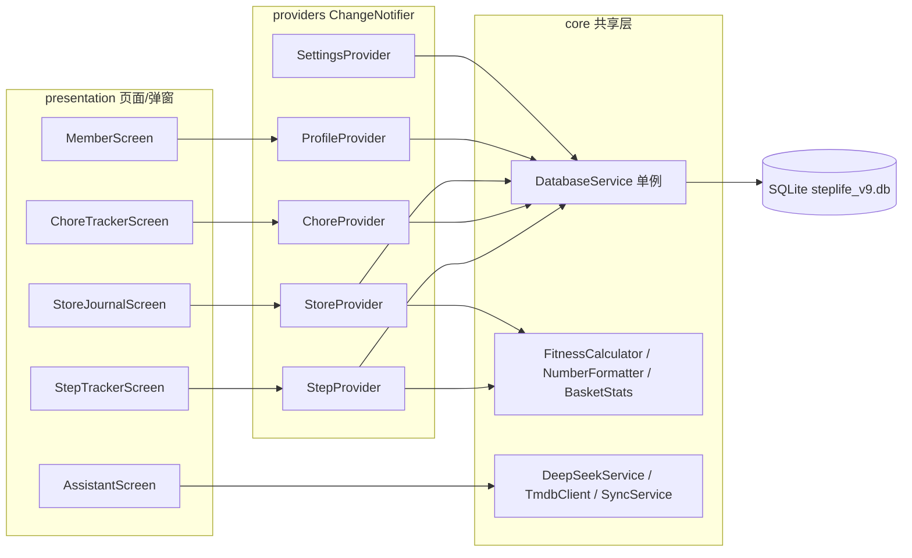

# StepLife（步履生活）架构说明与维护参考

> 本文档合并自原根目录 `ARCHITECTURE.md` 与 `update_rules.md`（2026-08 重组），是 [AGENTS.md](../AGENTS.md) 的深度参考：完整目录结构、分层数据流、数据库设计、算法、扩展指南，以及各条「核心规范」的详细说明与验证命令。
> 每次修改代码前必读的强制约束以 [AGENTS.md](../AGENTS.md) 为准。

## 1. 项目概览

- **定位**：个人生活记录与打卡类跨平台应用，覆盖「路线步数打卡、家务习惯追踪、生活记录（探店/影视/阅读/景点/购物/菜篮子/零食）、家庭成员管理、智能语音助手」业务域。
- **平台**：Flutter 跨平台，支持 Android / Windows / iOS / Linux / macOS（主力 Android + Windows 桌面）。
- **数据**：全部本地化，SQLite 持久化，无后端服务；WebDAV 手动云端备份/恢复。
- **入口**：`lib/main.dart`，底部导航共 4 个 Tab：路线 / 家务 / 生活 / 成员（「关于」已合并进设置中心）。
- **当前版本**：v1.5.0+20260819（SQLite Schema v9）。

## 2. 技术栈

| 类别 | 选型 | 说明 |
| --- | --- | --- |
| UI 框架 | Flutter (Material 3) | 深色毛玻璃（Glassmorphism）风格 |
| 状态管理 | `provider` 6.x | `ChangeNotifier` + `MultiProvider` |
| 本地数据库 | `sqflite` + `sqflite_common_ffi` | Schema v9，库文件 `steplife_v9.db`（升级前自动备份旧库） |
| 图表 | `fl_chart` / `flutter_heatmap_calendar` | 菜价走势/总表、成员贡献饼图、年度热力图 |
| 字体 | `google_fonts`（Outfit） | 全局字体 |
| 图片 | `image_picker` + `path_provider` | 生活记录照片，复制进应用缓存目录 |
| 定位 | `geolocator` | 美食位置一键定位/地图选点 |
| 语音 | `speech_to_text` | 智能助手语音转文字（Android 系统识别） |
| 计步 | `pedometer` | 路线计步测量（ACTIVITY_RECOGNITION） |
| 权限 | `permission_handler` | 运行时权限申请 |
| 网络 | `http` / `url_launcher` | TMDB / DeepSeek / 更新检查 / 拉起地图 |
| 其他 | `intl` / `path` / `package_info_plus` | 日期格式化、路径拼接、版本号 |

## 3. 目录结构

```
steplife/
├── android/ ios/ windows/ linux/ macos/ web/   # 原生壳（应用名：步履生活）
├── lib/
│   ├── main.dart                          # 应用入口：FFI 初始化、MultiProvider、PageView+底部导航(4 Tab)
│   ├── core/                              # 跨功能共享层
│   │   ├── db/database_service.dart       # SQLite 单例 DAO：Schema v9、非破坏迁移、app_settings CRUD
│   │   ├── settings/                      # 设置中心（含「关于」：版本历史/架构说明已合并）
│   │   │   ├── settings_provider.dart     # 设置状态：主题/视图/缓存/WebDAV/TMDB/DeepSeek
│   │   │   ├── settings_screen.dart       # 设置中心 UI + 更新记录与版本历史弹窗
│   │   │   └── settings_button.dart       # 全局设置入口（各 Tab 右上角）
│   │   ├── cache/                         # cache_manager（复制/统计/按上限清理）+ image_migrator
│   │   ├── network/tmdb_client.dart       # TMDB 搜索/详情/海报（可选接入）
│   │   ├── sync/                          # webdav_service + sync_service（备份/恢复编排）
│   │   ├── theme/app_theme.dart           # 全局深色主题与颜色 Token
│   │   ├── update/                        # app_updater（多源回退）+ update_dialog
│   │   └── utils/                         # fitness_calculator / number_formatter
│   └── features/                          # Feature-first：domain / providers / presentation
│       ├── step_tracker/                  # 路线资产与步量打卡（RouteItem / StepLog / RouteMeasurement）
│       ├── chore_tracker/                 # 家务习惯追踪（Member / ChoreItem / ChoreLog）
│       ├── store_journal/                 # 生活记录模板化打卡（8 模板 + TMDB 导入 + 菜篮子/零食）
│       │   ├── domain/life_templates.dart # 模板注册表 + 字段模型 + 分类匹配
│       │   ├── utils/basket_stats.dart    # 菜篮子价格统计/走势
│       │   └── presentation/...           # 画廊/动态表单/浏览卡片/详情页
│       ├── assistant/                     # 智能助手（DeepSeek v4-flash + 语音转文字）
│       │   ├── domain/assistant_models.dart
│       │   ├── services/deepseek_service.dart + assistant_orchestrator.dart
│       │   └── presentation/assistant_screen.dart
│       └── profile/                       # 全局生理档案与统一成员管理（MemberScreen/ProfileDialog）
├── assets/
│   ├── icon/app_icon.png                  # 100% 透明 Alpha 图标
│   ├── walkthrough.md                     # 内嵌架构说明与更新日志（设置中心在线查看）
│   └── screenshots/                       # README 应用截图
├── test/                                  # 单元与组件自动化测试
├── docs/architecture.md                   # 【本文件】架构说明与维护参考
├── AGENTS.md                              # AI 自动加载的协作红线与核心规范
├── README.md                              # 项目介绍/安装/发布说明
└── pubspec.yaml                           # 依赖与资源声明、版本号（1.5.0+20260819）
```

## 4. 分层架构与数据流

轻量分层 + Feature-first 组织：

- **presentation**：页面与弹窗，只负责渲染与交互，不直接访问数据库。
- **providers**：`ChangeNotifier`，持有内存态（列表/加载态），构造时通过 `DatabaseService` 加载数据，所有写操作先落库再更新内存并 `notifyListeners()`。
- **domain**：纯 Dart 模型（`fromMap` / `toMap` / `copyWith`），无 Flutter 依赖。
- **core/db**：`DatabaseService.instance` 单例，集中全部 SQL 与表结构。
- **core/utils**：纯函数算法，可单测。



跨模块共享关系：

- **成员档案共享**：`Member` 模型定义在 `chore_tracker/domain`，但步数打卡（`StepProvider`）与生活记录（同游成员）都复用同一套数据。
- **生理参数回退**：步数换算优先使用所选 `Member` 的身高/体重，缺失时回退到全局 `UserProfile`。
- **设置中心**：`SettingsProvider` 持有主题/缓存/WebDAV/TMDB/DeepSeek Key，全局唯一。

## 5. 功能模块

### 5.1 路线步数（step_tracker）
- 客观路线资产 `RouteItem`（名称/描述/测量人/参考步数/锁定状态）与打卡履约 `StepLog`（步行人/圈数/步数/时长/公里/千卡/时刻）严格解耦。
- 路线支持锁定防误删、一键按参考步数倍增打卡。
- 计步测量：`RouteMeasurement` 记录开始/结束步数与倍数，多次测量取平均换算单程步数，支持手动登记。
- 换算逻辑：`FitnessCalculator.estimateStrideLength` → `stepsToKilometers` → `calculateCalories`（MET）。

### 5.2 家务习惯（chore_tracker）
- `ChoreItem`（是否量化 + 单位）与 `ChoreLog`（参与成员 JSON、备注、量化数值）分离。
- 主页 5 天近况矩阵；量化家务按 `NumberFormatter.formatQuantifiableValue` 显示 `1.2k / 15k / 1.5M`（**不显示 ✓**）。
- `ChoreDetailScreen`：年度热力图 + 成员贡献占比饼图。

### 5.3 生活记录（store_journal）
- `StoreCategory`（分类，绑定模板）→ `StoreItem`（客观属性：名称/分类/评分/照片/地址/备注/extras）→ `StoreLog`（打卡履约：消费/同游成员/时刻/extras）三层解耦。
- 8 个内置模板：movie / dining / book / place / shopping / basket / snack / generic；分类可绑定模板并追加自定义字段（`custom_N`）。
- TMDB 导入（填 Key 后）：影视搜索自动填充片名/导演/主演/类型/海报；菜篮子：品类+品牌双维度、价格走势/总表/月份筛选；餐饮：菜单 + 份量规格独立定价 + 招牌推荐打分；零食：用户自定义 tag 分类。
- 分钟级打卡时刻（`yyyy-MM-dd HH:mm`）、1~5 星评分（部分为 5 星滑杆）、最多 3 张照片。
- Card / 紧凑列表双视图，经 `app_settings['preferredViewMode']` 持久化；专项排序偏好（时间/星级/打卡次数）按分类记忆。
- Drawer 分类支持创建、重命名（模板绑定 + 自定义字段）、安全删除（记录归「通用分类」）。

### 5.4 成员档案（profile + 成员系统）
- `Member`：姓名/性别/身高/体重/出生日期（动态计算年龄）/自定义步长/头像/颜色。
- `MemberScreen` 统一管理成员；`ProfileDialog` 维护全局生理档案；`members` 表由 chore_tracker 模块定义，全局共享。

### 5.5 智能助手（assistant）
- 入口：家务/生活 AppBar 左上角纯图标（无文字）。
- 流程：语音/文字 → DeepSeek（`deepseek-v4-flash`，结构化 JSON）→ 本地「名称存在性二次校验」（AI 匹配值必须命中本地清单，否则降级为新建确认）→ 确认卡片 → 用户确认后才调用 provider 落库。
- 覆盖：家务打卡/新建、生活打卡/新建、菜篮子品类+品牌、餐饮菜品+份量规格、成员与量化数值提取。

### 5.6 设置中心（settings，含原「关于」）
- 主题（深色/浅色/跟随系统）、视图偏好、缓存上限与图片质量、WebDAV 配置与备份/恢复、TMDB Key、DeepSeek Key、自动更新开关、更新记录与版本历史、架构说明（内嵌 `assets/walkthrough.md`）。

## 6. 数据库设计（Schema v9）

库文件 `steplife_v9.db`，`version: 9`，共 12 张表，全部由 `DatabaseService` 统一管理；WebDAV 备份表清单 `_syncTables` 含 11 张（不含 `app_settings`）。

| 表 | 关键字段 | 说明 |
| --- | --- | --- |
| `user_profile` | heightCm/weightKg/gender/age/customStrideCm/preferredViewMode | 单行（id=1）全局档案 + 视图偏好 |
| `routes` | name/description/measuredBy/refSteps/isLocked/createdAt | 客观路线资产 |
| `route_measurements` | routeId/steps/multiplier/... | 路线计步测量记录（多次测量取平均） |
| `step_logs` | routeId/routeName/walkerName/timesCount/steps/durationMinutes/distanceKm/caloriesKcal/timestamp | 步数打卡履约 |
| `members` | name/gender/heightCm/weightKg/customStrideCm/birthDate/avatarIcon/colorValue | 统一家庭成员（全局共享） |
| `chore_items` | title/category/iconName/isQuantifiable/unit | 家务事项定义 |
| `chore_logs` | choreId/memberIdsJson/memberNamesJson/memo/value/timestamp | 家务打卡履约 |
| `store_categories` | name(UNIQUE)/iconName/templateKey/extraFieldsJson | 生活记录分类（绑定模板 + 自定义字段） |
| `store_items` | name/category/rating/imagesJson/address/notes/extrasJson/createdAt | 生活项目客观属性 |
| `store_logs` | storeId/cost/visitorIdsJson/visitorNamesJson/memo/extrasJson/timestamp/menuItemIdsJson/menuNamesJson/menuSpecsJson | 生活打卡履约（含点菜与份量规格） |
| `store_menu_items` | storeId/name/price/imagePath/specsJson/rating/sortOrder | 餐饮菜单（份量规格独立定价 + 推荐打分） |
| `app_settings` | key TEXT PRIMARY KEY/value TEXT | 全局设置（Key 明文） |

迁移策略（详见 `database_service.dart`）：

- `onCreate`：建全部表 + 预置种子数据（成员 A/B/C、默认路线、默认家务、默认分类、示例生活项目与打卡）。
- `onUpgrade`：`oldVersion < 9` 时按版本号逐级执行 `ALTER TABLE` / `CREATE TABLE IF NOT EXISTS` 增量变更，全程单事务、幂等、行数对账 + `integrity_check`，失败整体回滚；升级前自动备份旧库（保留最近 3 份，含 WAL/SHM）。
- `onOpen`：幂等执行 `ALTER TABLE members ADD COLUMN birthDate`（兼容旧库，报错忽略）；`preferredViewMode` 从 `app_settings` 读取，缺省回退 `user_profile`，写入双写。
- 注意：新增表必须同步加入 `_syncTables` 与 WebDAV 恢复逻辑。

## 7. 核心业务算法

| 算法 | 位置 | 说明 |
| --- | --- | --- |
| 步长估算 | `fitness_calculator.dart` | 女性系数 0.413、男性 0.415 |
| 步数→公里 | 同上 | `steps × strideCm / 100000` |
| 卡路里 | 同上 | 按步频映射 MET（2.8~6.0），`MET × 体重(kg) × 时长(h)` |
| 数值缩写 | `number_formatter.dart` | <1000 原样、<1M 转 k、否则 M |
| 年龄计算 | `chore_models.dart` | `Member.age` 根据出生日期动态计算 |
| 菜价走势 | `basket_stats.dart` | 最近价/环比/30 天均价、总表与月份筛选、涨幅归一化对比 |

## 8. UI 主题与视觉规范

- 主题定义在 `core/theme/app_theme.dart`，全局唯一深色主题 `AppTheme.darkTheme`。
- 颜色 Token：主色 Emerald `#10B981`、辅色 Indigo `#6366F1`、强调 Cyan `#06B6D4`、背景 Deep Midnight `#0B1329`。
- 统一卡片毛玻璃（半透明白 + 圆角 + 细描边）、透明 AppBar、固定式底部导航。
- 文本框 hint 用低透明度小字号（如 white38 / 13px），与用户输入内容区分；卡片浏览界面避免复杂图表（趋势用 ↑/↓/→ 箭头小字）。

## 9. 平台适配与资源

- `main.dart` 在 Windows / Linux / macOS 上执行 `sqfliteFfiInit()` + `databaseFactory = databaseFactoryFfi`，桌面端 SQLite 依赖此初始化，不可删除。
- `pubspec.yaml` 声明资源：`assets/icon/app_icon.png`、`assets/walkthrough.md`、`assets/screenshots/`。
- Android 权限（`AndroidManifest.xml`）：INTERNET / ACCESS_*_LOCATION / RECORD_AUDIO / ACTIVITY_RECOGNITION / REQUEST_INSTALL_PACKAGES。
- 应用名「步履生活」；图标必须 100% 透明 Alpha（RGBA）DIB ICO。

## 10. 测试

`test/` 下现有用例：`fitness_calculator_test.dart`（步长/公里/MET）、`number_formatter_test.dart`（数值缩写）、`life_templates_test.dart`（模板匹配与字段序列化）、`legacy_import_test.dart` / `database_migration_test.dart`（迁移与旧数据兼容）、`member_screen_test.dart`、`widget_test.dart`（冒烟）。

## 11. 详细维护规则（原 update_rules 细则，2026-08 重组）

### 11.1 数据库升级规范
- 当前版本 `steplife_v9.db` / `version: 9`；改表结构必须递增版本号，`_onUpgrade` 与 `_onCreate` 双路径一致。
- 非破坏迁移：升级前备份旧库（最近 3 份，含 WAL/SHM）→ 单事务「只增列不重建表」→ 幂等（`PRAGMA table_info` 探测）→ 行数对账 + `PRAGMA integrity_check` → 迁移留痕（`app_settings.last_schema_migration`）→ 失败整体回滚。
- `onOpen` 幂等补齐 `members.birthDate`；`preferredViewMode` 新读 `app_settings`、回退旧字段、写入双写。

### 11.2 桌面端 FFI 兼容
- `sqfliteFfiInit()` 与 `databaseFactory = databaseFactoryFfi` 判断不可删除。

### 11.3 路线资产与行走打卡解耦
- `RouteItem` 与 `StepLog` 严格解耦；锁定路线禁止删除/误编辑；打卡按 `timestamp` 倒序。

### 11.4 统一家庭成员系统与生理换算
- `Member` 全局共享；换算优先成员身高体重，缺失回退 `UserProfile`；年龄动态计算。

### 11.5 uHabits 量化展示
- 量化家务主页阵列**绝不显示 ✓**，统一 `NumberFormatter.formatQuantifiableValue`。

### 11.6 生活记录模板化打卡与视图持久化
- 模板键 8 个；专属字段存 `extrasJson`；分类自定义字段 `extraFieldsJson`（`custom_N`）；`StoreLog` 分钟级时刻/消费/同行成员；双视图经 `app_settings['preferredViewMode']` 持久化；Drawer 分类管理；图片 `CacheManager.copyToCache`。

### 11.7 应用图标
- 100% 透明 Alpha（RGBA）DIB ICO，严禁白/浅色背景余边。

### 11.8 版本号与发布同步
- 版本以 `pubspec.yaml` 为准（当前 `1.5.0+20260819`）；Android 经 `flutter.versionCode/versionName` 自动继承。
- 发布时同步更新 `assets/walkthrough.md` 更新日志、设置中心「更新记录与版本历史」、README，保持多处一致。

### 11.9 WebDAV 备份/恢复完整性
- 新增数据库表必须加入 `DatabaseService._syncTables` 与恢复校验，并在 WebDAV「数据概览」体现；图片与 TMDB 海报缓存（cache/tmdb）随备份增量上传/按缺失恢复，恢复后自动重映射路径。
- WebDAV 网络异常统一走 `_friendlyError` 翻译（服务器未启动/跨网段/认证失败/超时/证书），禁止直接暴露原始 SocketException。

### 11.10 应用内自动更新链路
- 更新检查与 APK 下载多源回退（api.github.com → ghproxy.net / gh-proxy.com / ghfast.top / mirror.ghproxy.com），逐个失败才报错。
- APK 下载到应用 **cache 目录**（`getApplicationCacheDirectory()`），FileProvider 的 `cache-path` 已覆盖；改回 documents 目录会导致「无法打开安装器」。
- 拉起安装器前 Android 8+ 检查 `canRequestPackageInstalls()`，未授权跳 `ACTION_MANAGE_UNKNOWN_APP_SOURCES` 引导。
- 发布流程：提升 pubspec 版本 → 更新 walkthrough/README/设置历史 → 本地 release 构建验证 → commit → push → 远端 tag `v1.5.x+YYYYMMDD` 触发 CI 自动构建 4 架构 APK 并发布。

### 11.11 Android 权限
- 已含 INTERNET / 定位 / RECORD_AUDIO / ACTIVITY_RECOGNITION / REQUEST_INSTALL_PACKAGES；新增权限先核对清单并同步运行时申请与设置引导。

### 11.12 生活模板与菜篮子规范
- 每个模板的图片/备注输入框文案必须专门化：菜篮子=商品图片/备忘，影视=相关图片·剧照/长评，美食=美食图片/特色说明·推荐好菜·备忘，零食/书籍/景点/购物各配专属文案。
- 菜篮子同一品类支持多品牌（佳农香蕉/辉众香蕉），打卡品牌留空=通用；走势图、总表、浏览卡片需展示品牌信息。
- 餐饮菜单支持份量规格（大份/小份、一两/二两）独立定价；招牌推荐菜（👍）/不推荐（👎）在浏览卡片小字展示。

### 11.13 智能助手（DeepSeek）约束
- 模型固定 `deepseek-v4-flash`；Key 存 `app_settings`；入口为家务/生活 AppBar 左上角纯图标（无文字）。
- AI 仅返回结构化 JSON 动作；客户端必须做「存在性二次校验」（matchedName 需命中本地清单，未命中降级为新建确认）；**一切动作先渲染确认卡片，用户确认后才调用 provider 落库**。
- 语音用 speech_to_text（Android 系统识别），Windows 桌面退化为文本输入；录音权限需运行时申请。

### 11.14 计步测量
- 依赖 ACTIVITY_RECOGNITION 权限（Android 10+ 运行时请求）；计步器流需 onError 兜底；测量中状态用 Wrap 布局避免窄屏溢出；「无计步器」文案仅在非 Android 或权限被拒时展示（初始按 Platform 判断，禁止默认 false 误导）。

### 11.15 环境与代码约定
- `apply_patch` 不可用，文件读写走 Node REPL；Dart `${...}` 在 JS 模板串中写 `\${...}`；JS 字符串替换用 `split(old).join(new)`。
- git 需拆成单个已批准前缀命令执行（组合命令会被沙箱拦截）；commit 用 `git commit -F <临时文件>`。
- 大部分 Dart 文件 LF 行尾（git 提示 CRLF 警告属正常，勿批量转换行尾）。

## 12. 常用验证与测试命令

每次完成修改后**依次运行**，确保 0 错误后方可交付：

```powershell
flutter analyze
flutter test
flutter build apk --release
```

发布前额外验证：确认 key.properties 正式签名在位、`flutter build apk --release` 成功后再推 tag。

## 13. 扩展指南

新增功能模块的推荐步骤：

1. 在 `lib/features/<feature>/domain/` 建纯 Dart 模型（含 `toMap` / `fromMap`）。
2. 在 `lib/core/db/database_service.dart` 增加表结构与 CRUD（改表结构必须递增版本号并在 `_onUpgrade` 补迁移，且同步 `_syncTables` 与 WebDAV 恢复逻辑）。
3. 在 `lib/features/<feature>/providers/` 建 `ChangeNotifier`，构造时加载数据，先落库再更新内存。
4. 在 `lib/features/<feature>/presentation/` 建页面，仅通过 Provider 读写状态。
5. 在 `main.dart` 注册 Provider，并将页面挂入 `MainHomeScreen` 的 `PageView` / 底部导航（或设置中心入口）。
6. 关键算法放 `core/utils` 并补充单测；涉及新权限先核对 AndroidManifest 与运行时申请。
